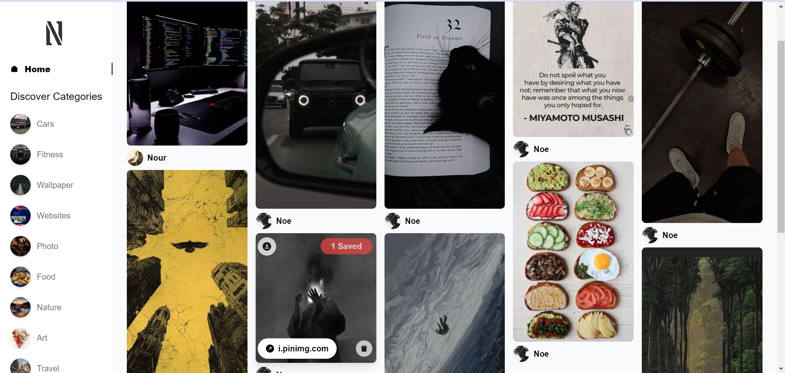

# Noumia - Your Creative Pinboard

Noumia is a dynamic web application that serves as your personalized creative pinboard. Similar to Pinterest, Noumia allows users to curate and share inspiring pins, fostering a community of creativity and self-expression. With a robust backend powered by Sanity, Noumia offers a seamless and enjoyable experience for users to showcase their creativity and discover new ideas.

# Link To Application: https://noumia.netlify.app/

## Key Features

- **Create Unique Pins:** Unleash your creativity by uploading images, providing titles, and adding detailed descriptions to your pins.
- **Community Interaction:** Engage with the Noumia community through comments, sharing thoughts, and connecting with other users who share your interests.
- **Organize Your Pins:** Build collections of your favorite pins for easy access and seamless sharing with others.
- **Download and Share:** Download images with ease and share your curated pins with friends and followers.
- **Delete Your Pins:** Tailor your pinboard by removing your own pins when needed, putting you in control of your creative space.

## Google Authentication

- **Seamless Login:** Enjoy a hassle-free login experience using Google Authentication. Sign in securely with your Gmail account and start pinning in no time.

## Technologies

- **Sanity Backend:** Noumia is powered by Sanity, providing a flexible and scalable backend for efficient data management.
- **Responsive Frontend with React:** Enjoy a dynamic and responsive user interface developed with React.

## Getting Started

To get started with Noumia, follow the instructions in the [Installation Guide](docs/installation.md).

<!-- Add any additional sections or information as needed -->

